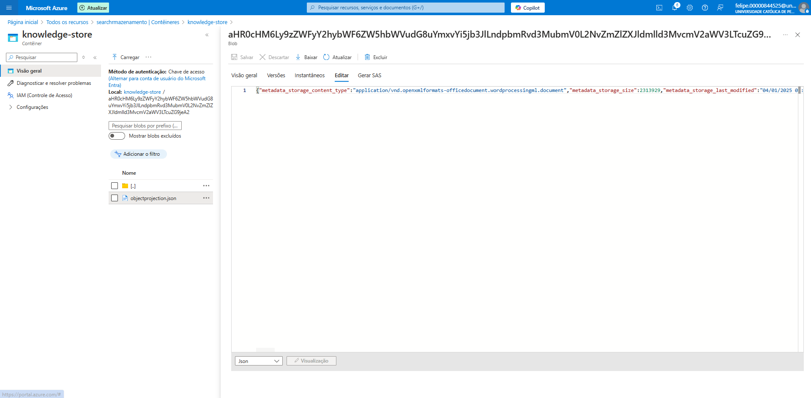
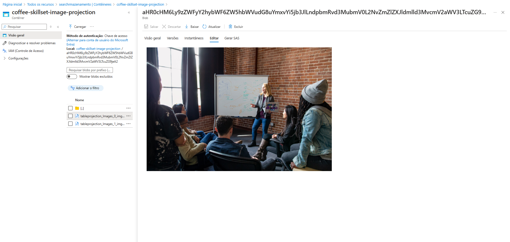

# Azure AI Search – Configuração e Aprendizados

Este documento descreve o passo a passo realizado para configurar um serviço de pesquisa com o **Azure AI Search**, além de compartilhar **insights**, **ferramentas que podem se beneficiar** com a tecnologia e os **aprendizados adquiridos** durante o processo.

---

## ✅ Etapas de Configuração da Pesquisa

### 1. Criação do Serviço de Pesquisa
- Acesse o portal do Azure: [https://portal.azure.com](https://portal.azure.com)
- Vá em **“Criar um recurso”** e selecione **Azure Cognitive Search**.
- Configure os campos:
  - Nome do serviço
  - Grupo de recursos
  - Região
  - Plano de preço (F0 – gratuito para testes)
- Clique em **“Revisar + Criar”** e depois em **“Criar”**.

---

### 2. Criação dos Dados de Origem (Blob Storage)
- Crie uma conta de armazenamento e um contêiner.
- Envie arquivos (ex: `.json`, `.pdf`, `.docx`, `.csv`) que servirão como base para indexação.
- Permita acesso público ou configure uma chave de acesso para uso no indexador.

---

### 3. Criando o Índice
- No serviço de pesquisa, vá em **“Importar dados”**.
- Selecione a **fonte de dados** (sua conta de armazenamento).
- Escolha um contêiner.
- Configure:
  - Nome do índice (ex: `coffee-index`)
  - Campos que deseja indexar (tipo, pesquisável, filtrável, ordenável etc.)

---

### 4. Criando o Indexador
- Ainda no assistente de importação, defina um **indexador** com nome (ex: `coffee-indexer`).
- Este será o responsável por "varrer" os dados no blob e populá-los no índice.
- Finalize e aguarde a execução.

---

### 5. Verificando a Execução do Indexador
- Vá em **"Indexadores"** (menu esquerdo).
- Clique sobre o indexador criado.
- Verifique o status como **“Êxito”** e veja a quantidade de documentos indexados.

---

### 6. Explorando os Dados com o Search Explorer
- Vá para a tela inicial do serviço.
- Clique em **“Explorador de pesquisa”**.
- Digite uma query como:
```json
  {
    "search": "*"
  }
```

- Isso retorna todos os documentos indexados.

## 💡 Insights

Azure AI Search é uma solução poderosa para transformar qualquer repositório de dados em uma plataforma de busca inteligente.

É ideal para **documentação interna**, **catálogos de produtos**, **pesquisa em bases jurídicas**, entre outros.

Com a integração do **Cognitive Skills**, é possível extrair insights de **áudio, imagem, texto e vídeo**, como **OCR** e **detecção de sentimentos**.

---

## 🧰 Ferramentas e Sistemas que Podem se Beneficiar

- **Sistemas de Atendimento ao Cliente**: permitindo buscas inteligentes em bases de conhecimento.
- **E-commerces**: com filtros, sugestões e ranking inteligente de produtos.
- **Plataformas Educacionais**: para facilitar a busca por conteúdos em PDF, slides e vídeos.
- **Intranets e Portais Corporativos**: indexando políticas, manuais, atas de reunião e mais.

---

## 📘 Aprendizados Adquiridos

- Aprendi que o **Search Explorer** é essencial para validar a estrutura dos dados e testar consultas.
- Compreendi melhor como estruturar **índices personalizados**, definindo quais campos são **pesquisáveis**, **filtráveis**, **ordenáveis** e **retrieváveis**.
- Vi na prática como o Azure pode integrar **fontes não estruturadas** com recursos de IA para gerar valor rapidamente.
- Também percebi a importância de **organizar bem o armazenamento** para que a indexação seja eficaz.

---

### ✅ Execução bem-sucedida do Indexador


### 🖼️ Imagem indexada no Blob


### 🔍 Consulta realizada com sucesso no Search Explorer

